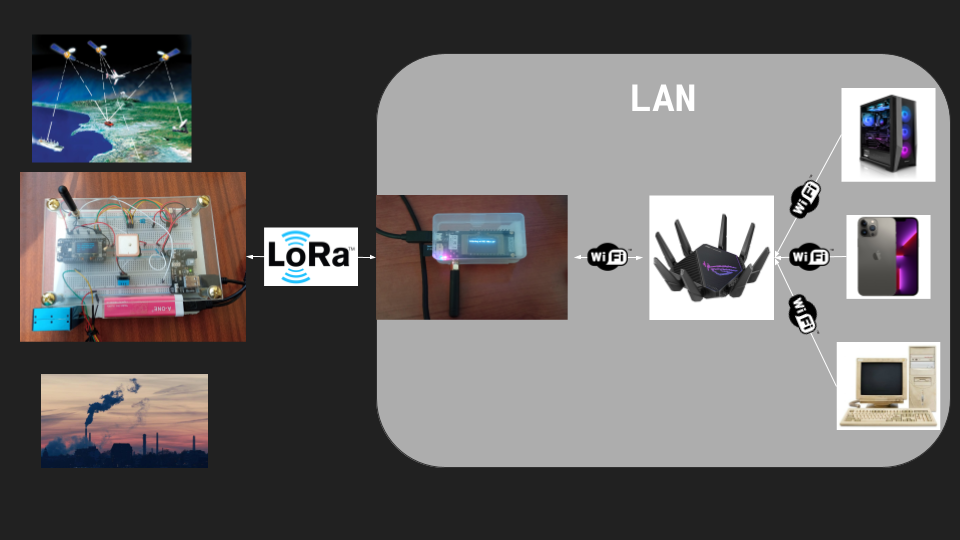

# olimpiadas-teleco
This project uses two esp32 with LoRa for measuring and analyzing air quality data with PMS5003 and MiCS-6814 sensors. It stores its data in an SQLite3 database in an SD Card.

This project works as this diagram shows:


# Getting started
1. You'll need to buy all of the following components:
    ### Sensor
     - [Heltec Cubecell GPS-6502](https://heltec.org/project/htcc-ab02s/) (Esp32, LoRa and GPS)
     - MiCS-6814 (NO<sub>2</sub>, CO and NH<sub>3</sub> sensor)
     - PMS5003 (PM2.5 and PM10 sensor)
     - DHT11 (Temperature and humidity sensor)
    ### Server
    - [Lilygo t3_v1.6.1](http://www.lilygo.cn/prod_view.aspx?TypeId=50003&Id=1130&FId=t3:50003:3) (Esp32, LoRa and Sd)
     - SD 2GB SanDisk

    > :warning: **As this project has been made specifically for this hardware, it may not work for even very similar devices!**

2. When you have the components bought, you will have to build the circuit as follows:

    Sensor 
    Server 

3. Once you've built the circuits, you'll have to load the [sensor](sensor/) code to the sensor using Arduino IDE 2.1.0 and the following libraries:
    - Time at version 1.6.1
    - DHT sensor library at version 1.4.4
    - PMS Library at version 1.1.0
    - Adafruit Unified Sensor at version 1.1.9

    You will have to install [Heltec Cubecell Series Arduino Development Environment](https://github.com/HelTecAutomation/CubeCell-Arduino) and upload your code selecting the board Cubecell-GPS (HTCC-AB02S)

    You will also have to load the [server](server/) code to the server using the same version of Arduino IDE and the following libraries:
    - ESP8266 and ESP32 OLED driver for SSD1306 displays at version 4.4.0
    - LoRa at version 0.8.0
    - AsyncTCP at version 1.1.4
    - ESP Async WebServer at version 1.2.3
    - Time at version 1.6.1
    - Sqlite3Esp32 at version 2.3
    - ArduinoJson at version 6.21.2

    You will have to install the [Arduino core for the ESP32, ESP32-S2, ESP32-S3 and ESP32-C3](https://github.com/espressif/arduino-esp32) and upload your code selecting the board ESP32 Dev Module.

    If your code doesn't compile because of errors try reading [this Arduino Forum post](https://forum.arduino.cc/t/esp32-unused-variable-compile-error/1039022/9).

    > :warning: **Make sure you have installed the [SiLabs drivers](https://www.silabs.com/developers/usb-to-uart-bridge-vcp-drivers) on your machine!**

4. To get the server to work you will have to upload the contents of the [web](web/) folder to your SD Card and create a .config file in it with the following schema:
    ```json
    {
        "ssid" : "YOUR_WIFI_SSID",
        "password" : "YOUR_WIFI_PASSWORD"
    }
    ```

5. Last, you will have to connect the SD to the server and connect both server and sensor to the electric current: In this project I've used a powerbank for the sensor, but batteries can be used.


6. Once you have it working, you have to get a device connected to the same network as the server and search for the IP that the server displays in the browser. Example:
    

# Offline work 
You can also use [this repo](https://github.com/dangarcar/olimpiadas-teleco-python) to analyze the same data offline 

# Possible future upgrades
- Connect it to the cloud
- Connect it to The Things Network
- Use AI to analyze data